# NvCache Client API (from source)

本文件依据源码 Z:\qihao\CloudApp\UserDoc\UserDocServer\NvCache.cpp NvCache.h 整理，修正并补全了客户端可用的 NvCache HTTP 接口定义、请求与响应细节、错误码及典型流程。

更新日期：2025-08-17

## 总览
- 基础路径：/NvCache/
- 角色：管理着色器/缓存类去重文件及其清单（Binary FileList）
- 主要接口（4个）：
  1) GET /NvCache/list
  2) POST /NvCache/check_files
  3) POST /NvCache/upload_file  （支持一次性上传或“分片完成”提交）
  4) POST /NvCache/upload_list  （上报清单增量）

约定与通用规则：
- 所有字符串按 UTF-8 处理，URL 查询参数需按 URL 编码。
- 所有带有 size 查询参数的接口，会严格校验 size == 请求体字节数，不一致则返回错误。
- SHA1 hash 必须为 40 位十六进制字符串（大小写均可，内部按小写处理）。
- 正常 JSON 响应以 {"code":0,"msg":"ok"} 为基准；错误时 code != 0，并配合 4xx/5xx HTTP 状态码。
- Binary FileList 的具体二进制结构由客户端按既有协议解析（服务端 Content-Type: stream/fileslist）。

服务端请求处理总览（仅服务端）：
- 路由前缀：/NvCache/
- 入口：CNvCache::httpProcess
  - list      -> CNvCache::HiPullList（拉取清单，内部先合并 queue）
  - check_files -> CNvCache::HiCheckFile（校验 hash 是否已存在于缓存）
  - upload_file -> CNvCache::HiUploadFile（保存哈希对象，支持分片完成提交流程）
  - upload_list -> CNvCache::HiUploadList（将增量 JSON 以 "$\r\n" 片段追加到 name.queue）
- 周期任务：
  - CNvCache::NvClearup(std::set<std::string> const& onlineSeats)
    - 合并积压的 *.queue
    - 清理离线 seat（回收 seat.list 的 RefCount 并删除 seat.list）
    - 清理 RefCount<=0 的哈希对象与相应数据库条目
  - CNvCache::NvClearup(int KeepDays)
    - 清理过期 *.list（按访问时间）并回收其 RefCount
    - 清理 NVCC_PREFIX 下过期/非法文件与目录

---

## 1) 拉取清单 GET /NvCache/list
- 路径：/NvCache/list
- 方法：GET
- 查询参数：
  - seat: string，必填。机器唯一标记（例如计算机名）。
  - name: string，必填。清单名称（建议“显卡名称 + 启动版本号”等）。
- 请求体：无

处理逻辑（要点）：
- 服务端把 name 映射到 name.list 与 name.queue（队列增量）。
- 如存在 name.queue，会将其合并进 name.list（原子替换）。
- 为 seat 维护一个 seat 专属的副本清单（SEAT/seat.list），用于引用计数增减。
- 若新旧清单签名（md5/ver）相同，直接返回缓存清单；否则生成新清单、更新引用计数并原子替换。

成功响应：
- 200 OK，Content-Type: stream/fileslist
- Body：二进制清单数据（CACHE_CONTEXT + 条目）

失败响应（示例）：
- 405 {"code":1,"msg":"Bad params"}：seat 或 name 缺失/为空；

### 服务端内部：HiPullList 详细流程
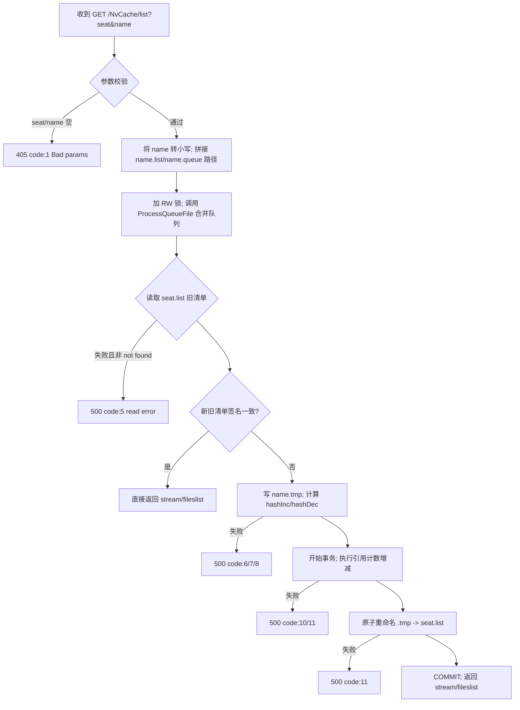

实现要点：
- name.queue 合并通过 ProcessQueueFile：将多段 JSON 以“]$\r\n[”连接的队列展开为一个数组并解析。
- 引用计数：通过旧/新清单差异（hashDec/hashInc）批量进行计数 +1/-1。
- 原子替换 seat.list：使用 FileDispositionInfo + ZwSetInformationFile(rename) 语义。

- 404 {"code":2,"msg":"Not Found"}：清单不存在；
- 500 {"code":5,"msg":"read error"}：读取 seat.list 失败（非不存在）；

### 服务端内部：HiCheckFile 详细流程
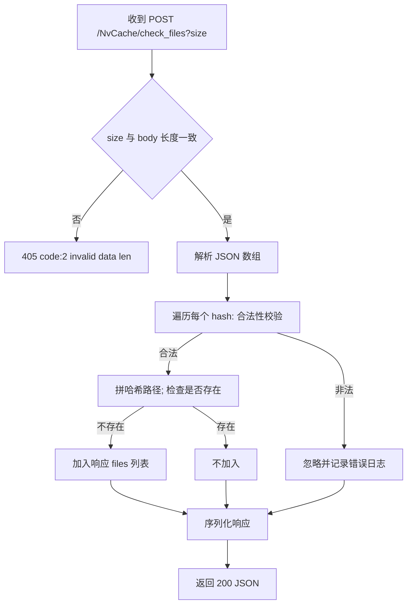
实现要点：

### 服务端内部：HiUploadFile 详细流程
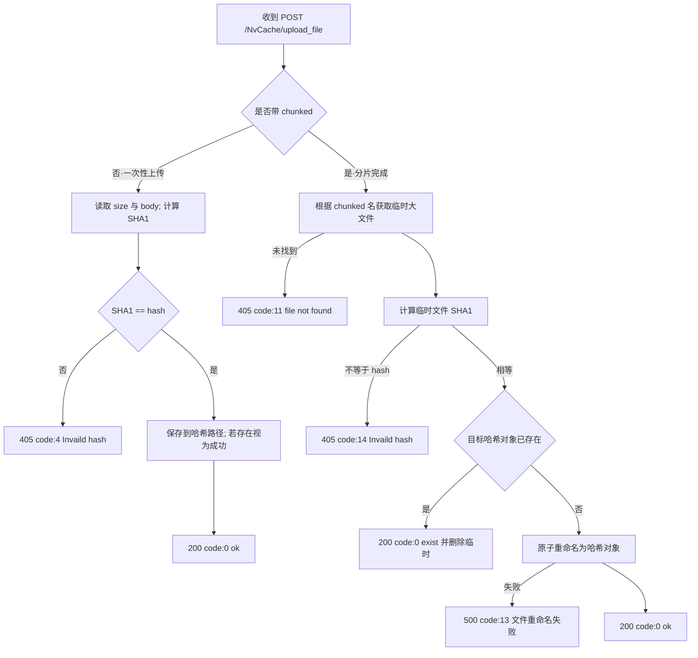
实现要点：
- 一次性上传路径：严格校验 size 和 SHA1；
- 分片完成路径：仅做校验与提交，分片过程由其他模块负责；
- 若目标已存在，返回 exist/ok，客户端可视为成功（幂等）。

- hash 必须 40 位十六进制；
- 存在性检查走本地缓存（NVCC_PREFIX）映射；
- 响应仅包含“缺失”的 hash。

- 500 {"code":6,"msg":"write error"}：写入 .tmp 失败；
- 500 {"code":7|8,"msg":"parse list error"}：清单解析失败；
- 500 {"code":10|11,"msg":"database failed"}：引用计数更新或重命名失败。

示例：
GET /NvCache/list?seat=pc-A010&name=RTX4060_1.2.3

---

## 2) 检查缺失文件 POST /NvCache/check_files
- 路径：/NvCache/check_files
- 方法：POST
- 查询参数：
  - size: uint64，必填。请求体字节数。
- 请求体（application/json）：数组，每项格式：{"hash":"<40hex>"}

示例请求体：
[
  {"hash":"0b0bd88b6b2901c047b8c223ae5c51236c2f79f1"},
  {"hash":"040bd88b6b2901c047b8c223ae5c51236c2f7134"}
]

处理逻辑：
- 校验 size 与实际字节数一致；校验每个 hash 格式合法；
- 返回“服务端不存在”的 hash 列表（需要上传）。

成功响应：
- 200 {"code":0,"msg":"ok","files":[{"hash":"..."}, ...]}

失败响应（示例）：
- 405 {"code":1,"msg":"Bad Request"}：无请求体；
- 405 {"code":2,"msg":"invalid data len"}：size 与实际不一致；
- 405 {"code":4,"msg":"Bad Request"}：请求体非合法 JSON。

---

## 3) 上传文件 POST /NvCache/upload_file
支持两种用法：一次性上传，或“分片完成”提交。

### 3.1 一次性上传
- 路径：/NvCache/upload_file
- 方法：POST
- 查询参数：
  - hash: string，必填，40位 SHA1 hex；
  - size: uint64，必填，请求体字节数。
- 请求体：二进制文件原始数据（raw）。

### 服务端内部：HiUploadList 详细流程
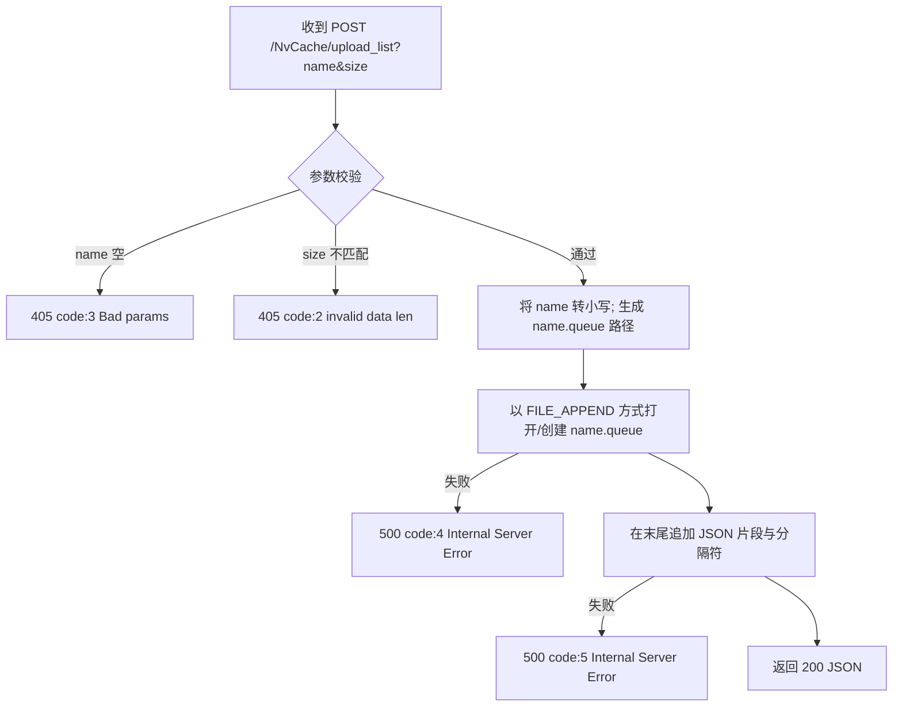
实现要点：
- 不直接合并，延后到 HiPullList 或后台清理统一处理，降低并发冲突。
- 多批次队列格式：服务端后续以“]$\r\n[”替换为逗号，串接为一个大的 JSON 数组再解析。

处理逻辑：
- 校验 hash 格式；校验 size；对请求体计算 SHA1 必须与 hash 一致；
- 将文件保存为哈希路径对象（存在则直接视为成功）。

成功响应：
- 200 {"code":0,"msg":"ok"}

失败响应（示例）：
- 405 {"code":1,"msg":"Bad Request"}：hash 缺失/非法；
- 405 {"code":2,"msg":"invalid data len"}：size 不一致；
- 405 {"code":4,"msg":"Invaild hash"}：内容 SHA1 与 hash 不一致；
- 500 {"code":5,"msg":"Save file failed(0x...)"}。

### 3.2 分片完成提交
- 路径：/NvCache/upload_file
- 方法：POST
- 查询参数：
  - hash: string，必填，40位 SHA1 hex；
  - chunked: string，必填，会话名/临时大文件标识。
- 请求体：无（或空）。

处理逻辑：
- 按 (chunked, hash) 找到已上传的临时大文件；计算其 SHA1 与 hash 必须一致；
- 若目标哈希对象已存在：返回 exist 并删除临时文件；否则原子重命名为目标对象。

成功响应：
- 200 {"code":0,"msg":"ok"} 或 {"code":0,"msg":"exist"}

失败响应（示例）：
- 405 {"code":11,"msg":"file not found"}：未找到会话文件；
- 405 {"code":14,"msg":"Invaild hash"}：临时文件 SHA1 与 hash 不一致；
- 500 {"code":13,"msg":"file rename failed 0x..."}。

---

## 4) 上报清单增量 POST /NvCache/upload_list
- 路径：/NvCache/upload_list
- 方法：POST
- 查询参数：
  - name: string，必填，清单名称；
  - size: uint64，必填，请求体字节数。
- 请求体（application/json）：数组，元素为以下两种之一：
  - 增加 add：
    {
      "add": {
        "hash": "40hex",           // 文件时必填；目录可不填
        "path": "relative\\path", // 必填，相对路径
        "size": 123,                 // 文件大小

## 服务端周期任务与内部清理（仅服务端）

### 在线 seat 管理与清理（NvClearup(onlineSeats)）
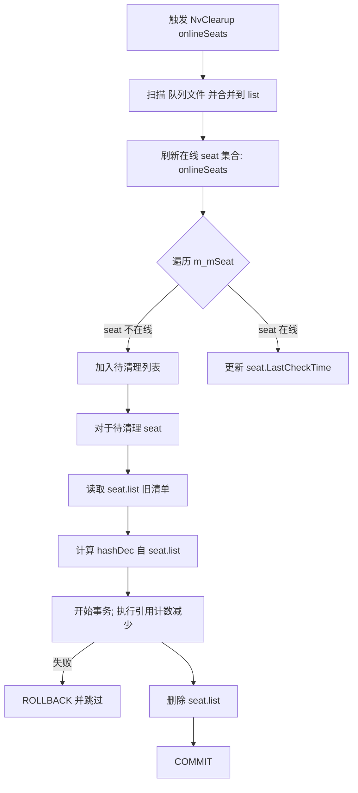

实现要点：
- “在线”判断依赖调用方传入的 onlineSeats（通常由上层连接管理获得）；
- 对长时间不在线的 seat 执行回收：将其 seat.list 中的引用全部 -1，删 seat.list；
- 日志聚合输出清理结果（文件计数、失败统计等）。

### 无参清理（NvClearup(KeepDays)）
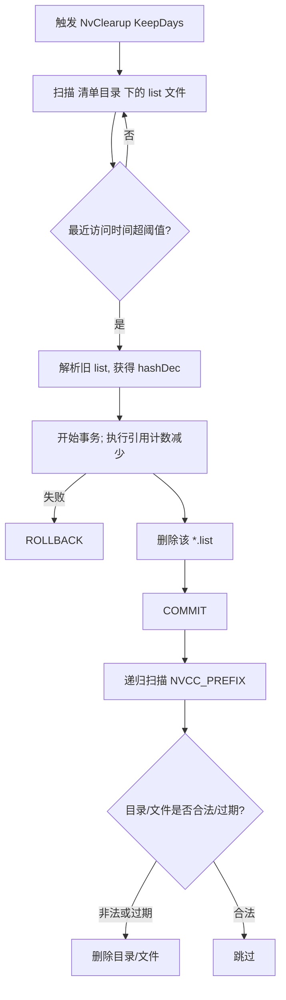

实现要点：
- KeepDays 计算清单保留期（源代码取 KeepDays/2）；
- 删除 *.list 前先回收其引用计数；
- NVCC_PREFIX 下仅保留二级16进制目录与 40hex 文件，其它会被删除；
- 针对 RefCount<=0 的哈希文件，尝试物理删除并清理数据库记录。

        "attr": 32,                  // Windows 文件属性（目录请包含 FILE_ATTRIBUTE_DIRECTORY）
        "time": 13345788111235454    // 文件时间（单位：100ns tick）
      }
    }
  - 删除 del：
    {"del":{"name":"relative\\path"}}

处理逻辑：
- 服务端将该 JSON 末尾追加 "$\r\n" 并以“追加”方式写入 name.queue；
- 真正合并发生在 /NvCache/list（或后台清理）阶段：
  - 解析队列，把 add/del 应用到现有清单；
  - 对 add 的文件，会检查哈希对象是否存在，不存在则忽略并警告；
  - 对 hash 引用计数进行增减；
  - 原子替换 name.list。

成功响应：
- 200 {"code":0,"msg":"ok"}

失败响应（示例）：
- 405 {"code":1,"msg":"Bad Request"}：无请求体；
- 405 {"code":2,"msg":"invalid data len"}：size 不一致；
- 405 {"code":3,"msg":"Bad params"}：name 为空；
- 500 {"code":4|5,"msg":"Internal Server Error"}：打开/写入 .queue 失败。

### 请求/响应字段详解（补充）
- seat（string）：客户端“席位”标识。服务端为每个 seat 维护独立的 seat.list，用于引用计数的增减。
- name（string）：清单主名，映射 name.list 与 name.queue。
- size（uint64）：HTTP 请求体字节数。所有带 size 的接口服务端都会严格校验。
- hash（40hex）：SHA1 校验值，大小写均可（内部小写）。
- path（string）：相对路径，清单条目路径；删除时用 name 字段指明。
- attr（uint32）：Windows 文件属性；目录应包含 FILE_ATTRIBUTE_DIRECTORY。
- time（int64）：文件时间，单位为 100ns tick（源码使用 FILETIME 相关转换）。
- Content-Type：
  - stream/fileslist：二进制清单；
  - application/json：JSON 响应。

### 客户端重试与幂等建议
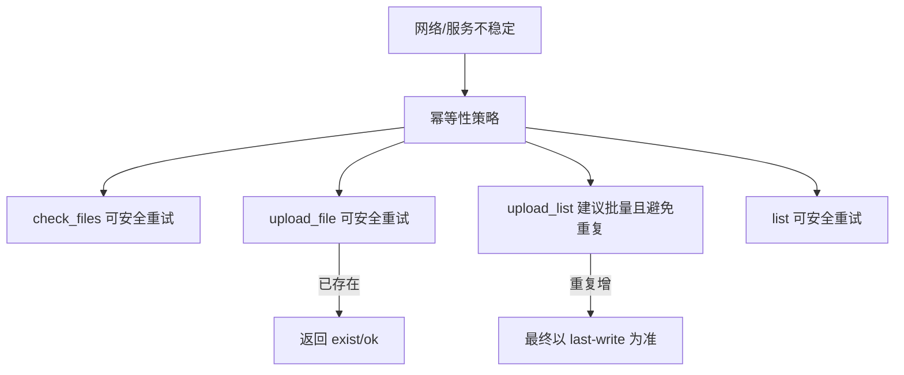

要点：
- check_files：读取型，重试安全；
- upload_file：按 hash 去重，若服务器已存在，同样返回成功语义（exist/ok），重试安全；
- upload_list：建议客户端对同一批次的增量去重后再提交，避免重复 add/del；
- list：读取型，重试安全；
- 建议对 5xx 使用指数退避重试，405/4xx 需修正参数后再发。

### 服务器引用计数与 seat 交互（深入）
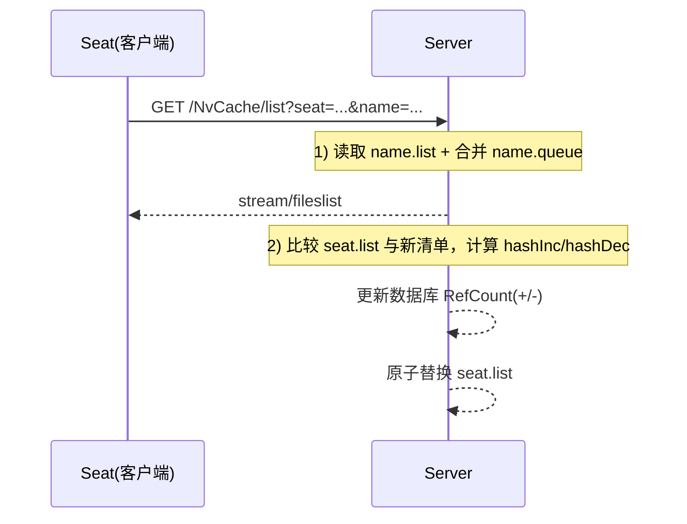

---

## 典型流程图（Mermaid）
以下 Mermaid 定义可直接渲染为流程图（建议使用 mermaid-cli 或 VSCode 插件）。

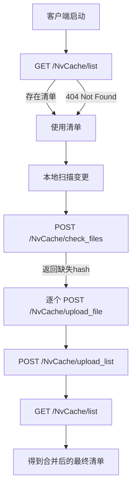

### 端到端详细流程（含分支与错误处理）
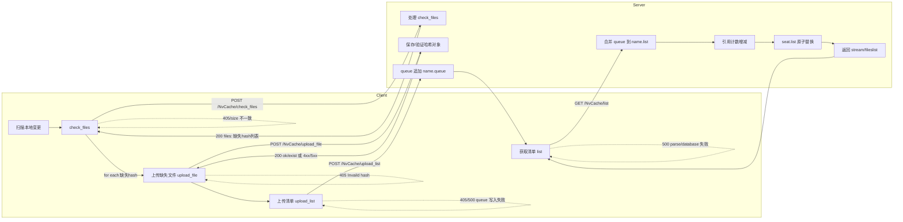

### 合并与生成清单内部过程（服务端视角）
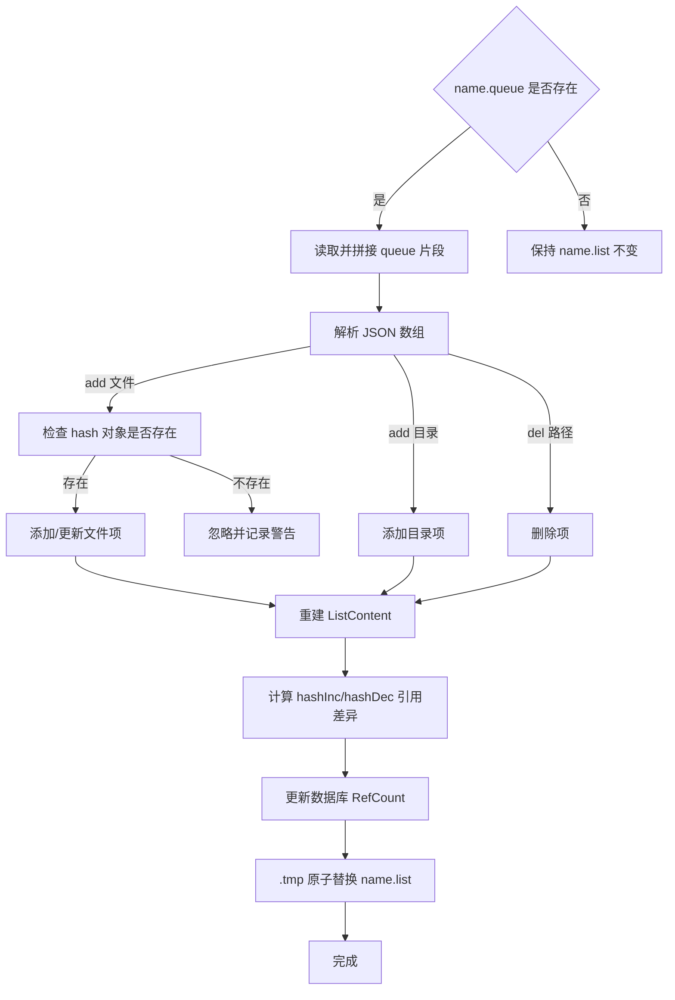

### 上传文件（一次性）与检查缺失（时序图）
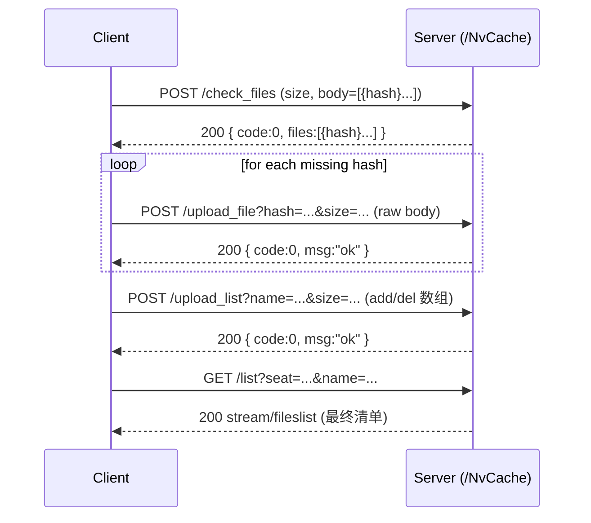

---

## 错误码速查
- 1: Bad params / Bad Request（参数缺失或请求体缺失/非法）
- 2: invalid data len（size 与实际字节数不一致）
- 3: Bad params（upload_list 的 name 缺失）
- 4: Invaild hash / Bad Request（hash 校验失败或 JSON 非法）
- 5: read/write/Save file failed（具体见接口）
- 6: write error（list .tmp 写失败）
- 7/8: parse list error（清单解析失败）
- 10/11: database failed（引用计数或文件重命名失败）
- 13: file rename failed（分片完成阶段）
- 14: Invaild hash（分片完成阶段 sha1 不一致）

---

## 备注
- 服务端内部还包含定期清理与 seat 在线状态管理，不影响客户端 API 的使用方式。
- 若采用分片上传，分片的“合并”不在本文接口范围内；/upload_file?chunked= 会话名 仅负责将合并结果提交为最终对象。

